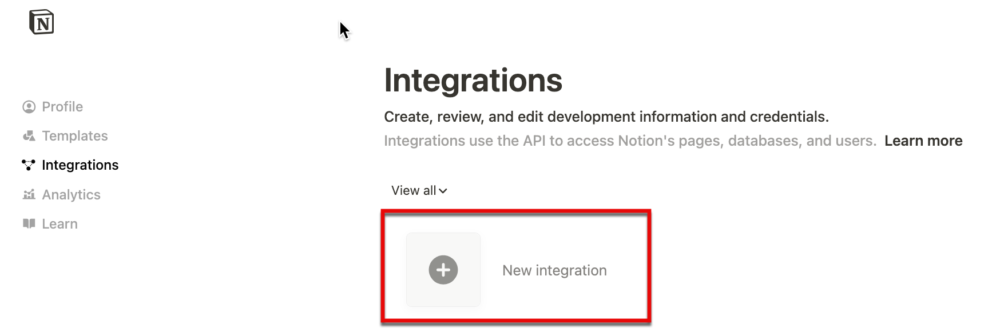

 # Setting up Notion Token and Access

This will walk you through creating a Notion integration, getting the auth token, and adding the integration to the proper NIMS databases.

1. Go to `Manage Connections` in Notion
    

2. Click `Develop or manage integrations`
    

3. Click `New integration`
    

4. Configure the new integration:
    * Give it a name, ex: `nims_template`
    * Choose the workspace
    * Type: `Internal`
    * Click `Save`
    

5. Click `Configure integration settings`
    

6. Copy the `Internal Integration Secret` -- this is your auth token for your `.env` file
    * Click `Save`
     

7. Navigate to your `Alert Database`
    * Click the 3-dot menu and find `Connections`
    * Click on your newly created integration
    

8. Click `Confirm`
     

9. Repeat steps 7 and 8 for the `Asset Database`